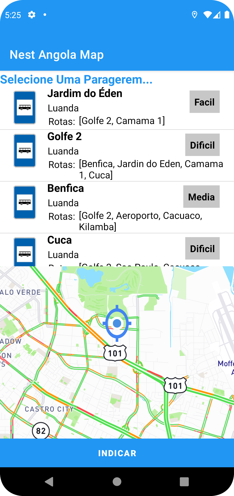
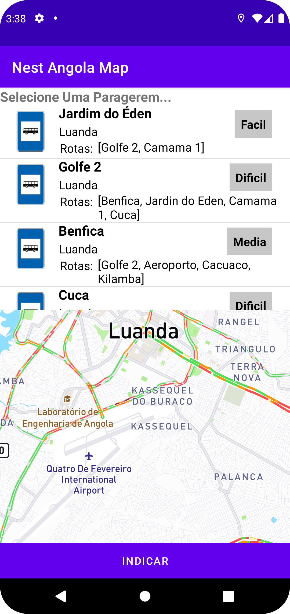
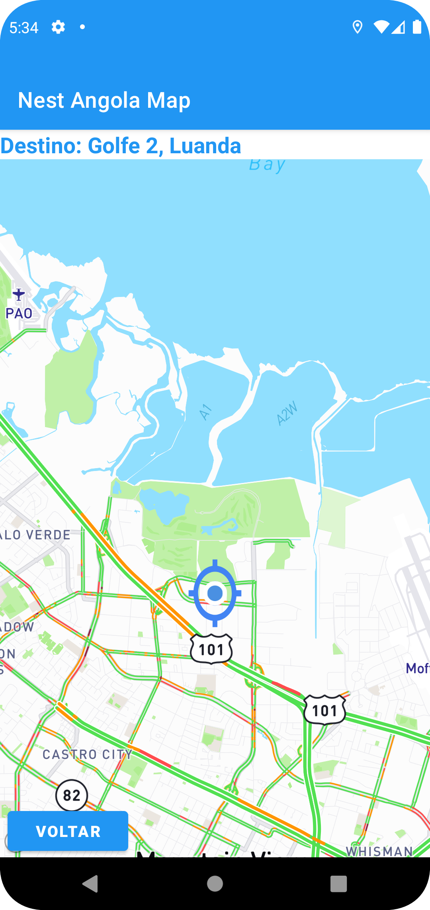

# Nest Angola Map (Táxi Paragem)

Seu aplicativo de geolocalizão para te ajudar encontrar a melhor paragem de táxi. Agora ficou mais fácil localizar todas as paragens e saber qual dificdl está apanhar um táxi naquela localidade.


## Screenshots

    


## Demonstração

Insira um gif ou um link de alguma demonstração


## Funcionalidades

- Geolocalização
- Marcação de Paragem de táxi mais proximas
- Localização em tempo real 📌
- Temas dark e light
- Plataforma Android


## Instalação

 1 - Instale o app com android físico baixando usando o link: [app-release](https://drive.google.com/file/d/1Ha6qGj4Un7Uz2ELxYfALL16hIYt7zR7S/view?usp=sharing)

 2 - Instale o app com android físico baixando usando o link: [app-debug](https://drive.google.com/file/d/1Ha0N_AhM6ecUO4JUjybqQOBDqIK7eygy/view?usp=sharing)

```
 * Use a 2º opção se for para fazer o em um emulador de android, pois o 
```
    
## Autor

- [@hendapaim](https://www.github.com/hendapaim)


## Feedback

Se você tiver algum feedback, por favor me deixe saber por meio de hendapaim@gmail.com

